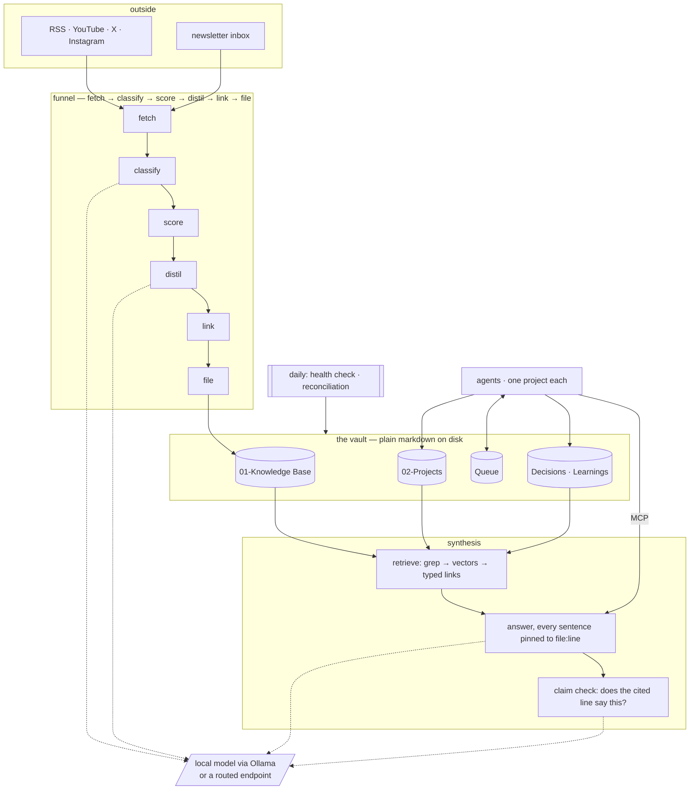

<picture>
  <source media="(prefers-color-scheme: dark)" srcset="assets/logo-dark.svg">
  
</picture>

# Mikoshi

**A self-evolving brain.** A folder of plain markdown that ingests, files, links, ages, repairs and grades itself — and that several AI agents can work inside at once without treading on each other.

## What it is

Agents forget. Every session starts blank, so the same decision gets re-made, the
same dead end gets re-explored, and the person in the middle ends up being the
memory — routing messages between tools and re-explaining context they already
explained last week. Notes apps do not fix this, because they are written for a
human reader and an agent cannot tell a decision from a draft.

Mikoshi is the layer that makes a folder of markdown behave like shared memory.
It sets down who may write what and how they record it, gives agents a channel to
ask each other for things instead of going through you, pulls in new material
from the outside on a schedule, and answers questions about the whole thing with
a citation to the exact line it took each fact from. Everything is plain text on
your own disk — no database, no server, and it still opens in any editor.

## How it works

1. **Agents work inside one project each.** Full authority in their folder, none outside it. When one needs something another owns, it posts a handoff in a shared queue rather than reaching across.
2. **Everything durable is written down as it happens** — what was decided, what was turned down and why, and what an agent learned the hard way. Not summarised at the end of a session, which is how it gets lost.
3. **The funnel pulls the outside world in.** RSS, YouTube, X, Instagram and a newsletter inbox are fetched; mail, meeting transcripts and Drive documents are read by a scheduled session that already holds those connections, so no API key exists for any of them. Everything is judged, scored, distilled and filed as linked notes, and anything matching nothing existing is flagged rather than filed as an orphan.
4. **You teach it what counts.** Mark a filed item signal or noise and the classifier is shown your own verdicts — real examples of your taste, in the prompt where the judgment happens. It changes nothing until there are enough marks to show a pattern, and says so.
5. **Notes age.** A newer note supersedes an older one on the same subject and leaves a one-line tombstone. Nothing rots quietly.
6. **The synthesis layer answers questions.** It retrieves, writes an answer, and pins every sentence to a file and line you can open. Sentences it cannot pin are deleted before you see them.
7. **Maintenance runs itself.** A daily job repairs broken links, schema drift, stale ownership claims and queue hygiene, and logs every fix so the autonomy is auditable.
8. **It keeps score on itself.** Record a claim with a date and a confidence, and it is graded against what actually happened — a Brier score against the do-nothing baseline, broken down by confidence band, so being sure and wrong is visible instead of averaged away.

**What "self-evolving" means here, precisely.** Four loops run without being asked, and each is auditable: it **ingests** on a schedule, it **ages** notes out and supersedes them, it **repairs** its own structure daily, and it **learns your taste** from verdicts you mark. A fifth — **grading its own confidence** — starts the moment you record a prediction. None of them touch what you decided; all of them are logged.

## Architecture



## Stack

| Layer | What | Why |
|---|---|---|
| Store | plain markdown + JSONL, on disk | opens in any editor; survives every tool that reads it |
| Index | SQLite, `sqlite-vec` for embeddings | one user and a few thousand vectors is not a database problem |
| Retrieval | grep first, then vectors, then a walk of typed links | grep cannot silently drop a borderline result the way ranking can |
| Models | Ollama — `gpt-oss:20b` for judgment, `nomic-embed-text` for embeddings | free, private, no key; a hosted endpoint is opt-in |
| Routing | optional OpenAI-compatible endpoint via `MIKOSHI_LLM_BASE_URL` | send each call to the model measured good enough for that job |
| Interface | MCP server exposing six tools | any MCP-speaking agent gets the vault as tools, no adapter |
| Scheduling | whatever your agent harness offers | the routines are ordinary scripts; nothing here owns a daemon |
| Language | Python 3.11+, no framework | the whole system is readable in an afternoon |

## Key points

- **It runs entirely on your machine with no API key.** The local model holds about 13 GB of RAM while it works and takes roughly a minute a question.
- **A hosted model is opt-in, not the default** — set `MIKOSHI_LLM_BASE_URL` to **any** OpenAI-compatible endpoint. Switching to a paid route is a money decision, so it never happens by accident.
- **Several sources need something you may not have**, and each is off rather than broken: X needs a self-hosted RSSHub, Instagram needs `gallery-dl` and a logged-in browser profile, the QA layer needs Docker and a 12.8 GB image, and mail/meetings/Drive need a scheduled session holding those connections. `doctor.py` names every one.
- **Retrieval measures 85% right-answer-first and 95% in the top five** on a 20-question set.
- **Answers cite the correct file 67% of the time on the local model and 85% routed**, with 71% and 87% of sentences supported by the line beside them (30 questions, set `bf02b3bcba`). Routed is better at everything except refusing — it answered one question the vault does not hold instead of saying so, which is why local is still the default.
- **Run-to-run noise is about ±2 points on citation accuracy**, measured by running one 120-case exam twice at temperature 0. **It is not the same for every metric** — claim-support read 82% and then 94% on the same model and question set two hours apart, so that column's floor is at least ±12 and has never been properly measured. Carrying one metric's floor to another is a mistake this project has now made three times.
- **You can take it apart and measure the pieces.** `synth.ablate` runs the question set once per memory store removed, so each store's contribution is a number rather than an assumption. First run: removing the markdown corpus drops citation accuracy 85% → 33%; removing recorded decisions costs 18 points; removing recorded learnings *improved* citation accuracy by one case while costing 9 points of claim support — so it helps support sentences, not find files.
- **Nothing is stored that you cannot read.** If Mikoshi disappeared tomorrow you would still have a folder of markdown.
- **Mail, meetings and Drive are scoped, not swallowed.** Mail must carry a label you apply, Drive reads only folders you declare, and a meeting whose title marks it personal is dropped. Undeclared scope means nothing is read, not everything.
- **A silent source is reported as an outage, not as a quiet day.** `funnel.connectors status --strict` exits non-zero when a connector has stopped dropping — the failure that once lost nine newsletters behind a clean-looking log.
- **The rules are load-bearing, not ceremony.** Of 27 answerable questions on the vault this came from, **24 were answered out of artifacts the protocol creates** — 12 from the protocol file, 8 from the decision record, 4 from project logs. Customising the bedrock customises away the accuracy.
- **Predictions are the one record that can be wrong.** Decisions and learnings are written after the fact, so neither can be graded. `record.py prediction` takes a claim, a date and a confidence; `synth.calibration` scores it later against the 0.25 baseline and shows where confidence was honest and where it was not. **A claim nobody can check is excluded rather than counted as a miss**, and the unresolvable rate is printed beside the score — otherwise the number flatters whatever was phrased safely.
- **Nothing leaves the machine unchecked.** `jobs.privacy_check` reads eight surfaces before anything is published — file contents, filenames, images (OCR'd and asked whether a person is in them), video frames, PDFs, embedded metadata, git history and commit identities — because a secret deleted in the last commit is still in the history, and a screenshot carries a hostname in a corner nobody looks at. Identifiers come from your own vault rather than a hardcoded list.
- **Standing rules have checkers, not good intentions.** `jobs.no_hardcoding` fails the build on an absolute path, a bare host, a pinned model or a personal account inside shipped code; `verify.py` fails an install that cannot write and read back a real record. Every rule this project relies on has something that fails on it, because the ones that did not had quietly accumulated violations for five weeks.
- **The three routines ship with it.** `05-Orchestrator/routines/` holds the daily health check, the reconciliation pass and the ingestion run as ordinary prompts. Nothing here owns a daemon, and nothing runs unattended until you schedule them.
- **It has been run by one person on one machine.** Portability is designed for and unproven.

## Getting started

**The short version: let your agent install it.** Open Claude Code, Codex or
anything else that can read a file and run a command, in an empty folder, and
paste:

```
Read and follow every step of BOOTSTRAP_FOR_AGENTS.md in
https://github.com/M19K/mikoshi — you are the installer.
```

It will check what is missing, run the interview, prove the install works, wire
itself to the vault over MCP, and tell you the three things to try. **Mikoshi is
built for agents, so an agent installing it is the path that gets tested.**

### By hand

```bash
git clone <this repo> my-vault && cd my-vault
```
```bash
ollama pull gpt-oss:20b && ollama pull nomic-embed-text
```
```bash
python3 init.py
```
```bash
.venv/bin/python doctor.py      # Windows: .venv\Scripts\python doctor.py
```
```bash
.venv/bin/python verify.py
```

`init.py` builds a virtual environment inside the vault and installs what it
needs. **Use the vault's own Python from then on** — `.venv/bin/python`, or `.venv\Scripts\python` on Windows — the routines call it by name,
and a system Python new enough to implement PEP 668 refuses `pip install`
outright, which is most machines now.

**`doctor` and `verify` answer different questions.** Doctor says what is *missing*; verify says whether what is there actually *works* — it writes a real decision through the real path, reads it back, removes it, scans for key material, and self-tests the MCP server. **Exit 0 or the install is not done.** An install can pass doctor and still be broken, because doctor never writes anything.

**`doctor.py` is the one to run whenever something seems off.** It lists what is
missing at three levels — required, degraded, optional — and the middle one is
the point: vector search failing prints one line in an otherwise healthy run,
and a source that stopped arriving looks exactly like a quiet week.

**Then schedule the three prompts in `05-Orchestrator/routines/`, or nothing
runs unattended.** They are what repairs the vault, pulls the outside world in,
and notices when a source goes quiet. Without them Mikoshi answers questions and
holds your records but does not maintain itself.

`init.py` interviews you — your areas of focus, how you want to be spoken to,
what stops at you, what you consider signal — and writes the vault from your
answers. **It never asks about the protocol**, because that half is fixed.

**Two files, and the split is deliberate.** `PROTOCOL.md` is the bedrock: the
same in every vault, never edited, replaced whole when the protocol version
moves. `CLAUDE.md` is yours: written from your answers, edited freely, and
untouched by an upgrade because nothing of yours was ever in the other file.

**Your first day will feel empty.** With nothing written down the answer layer
answers almost nothing — measured at 0 of 27 on an empty store. It is refusing
to invent, not failing. Value arrives in proportion to what you put in, and the
notes are two thirds of it.

## Status and licence

**Working and in daily use by its author; not yet used by anyone else.** The
funnel, the queue, the record format, the synthesis layer, the health check, the
cost ledger, the privacy check and the calibration score all run. Published
2026-08-23 — **the install is proven by CI on four platform-and-version
combinations, which is not the same as proven by a stranger.**

**179 unit tests**, on four platform-and-version combinations, alongside the
clean-install check — see [`tests/README.md`](tests/README.md), which states
what they do *not* cover as plainly as what they do. They are deliberately
narrow: they hold down the paths whose failure is silent, because every one of
those has failed at least once here. Answer quality is still measured by evals
against fixed question sets rather than by tests, and the image and video
passes of the privacy check have no automated coverage at all — they need OCR
and a local vision model, and images are the surface where the real leaks live.
**Clearing this repo for publication found two more of exactly that shape:** an
SVG is markup, so the image pass never opened it and the text pass skipped it
for its suffix — checked by neither — and one script hardcoded its author's
GitHub account, which on your machine would have reported *your* commits as
missing.

**The feedback loop exists but has never fired.** Mark an item signal or noise
and the classifier is shown those verdicts — except that it deliberately does
nothing until 30 marks exist with both sides represented, and no store has
reached that yet. So today it grows and maintains itself; whether it gets
better at judging is untested.

MIT. See [LICENSE](LICENSE).

