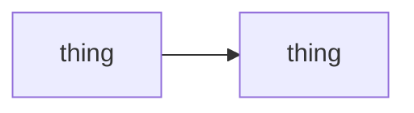

# Product README Standard

> **Every product the owner ships uses this shape.** [@owner · 2026-08-22] Not a
> suggestion — a repo whose README does not follow it is not finished. Applies
> to the five that exist today and to every one after them.

**Why it exists.** Five products were documented five different ways, and a
reader landing on any one of them could not tell what class of thing it was, how
it worked, or what it ran on. A README is the only page most people will ever
read, and inconsistency across a portfolio reads as inconsistency in judgment.

**The audience is both people at once.** [@owner · 2026-08-22] Semi-technical:
plain enough that someone non-technical follows how it works, precise enough
that an engineer does not have to guess. Where those pull apart, say the plain
thing first and the precise thing immediately after — never only one.

---

## The classes

Every product is exactly one of these. **State the class in the first line
under the title**, so it is the first thing read.

| Class | What it means | Who it is for | Today |
|---|---|---|---|
| **Product · proprietary** | A thing an end user opens and uses. Source stays closed. | Its users | *(your closed-source product)* |
| **Product · open source** | A thing an end user opens and uses. Source is public and someone else can build on it. | Its users, and developers | *(your open product)* |
| **Integration** | Infrastructure that sits between other things and makes them work better. Not opened by an end user. | Developers and agents | Mikoshi |

**The line between a product and an integration is who opens it.** If a person
launches it and looks at it, it is a product. If it sits in the path of other
software and earns its place invisibly, it is an integration. That test decides
the class; nothing else does.

---

## The required sections, in this order

A README missing any of these is incomplete. Extra sections are fine after them.

### 1 · Title and one-line class
The name, then one line: what class it is and what it does, in under twenty
words. No tagline, no adjectives.

### 2 · What it is
Two short paragraphs at most. What problem existed before it, and what it does
about that. **Written for someone who has never heard of it** — no internal
vocabulary, no reference to other products of ours without explaining them.

### 3 · How it works
The mechanism, in plain language, as numbered steps where there is a sequence.
This is the section a non-technical reader must be able to finish. **Say what
actually happens**, not what it is "designed to" do.

### 4 · Architecture
**A diagram, not a description.** A Mermaid block, because it renders on GitHub
without a build step and stays editable as text. Show the real boxes and the
real arrows — what calls what, where data lands, what is outside the trust
boundary. A diagram that hides a component to look tidy is worse than none.

### 5 · Stack
A table: layer, what is used, and one clause on why. **Name versions where a
version matters.** Include the things people forget — the model, the store, the
scheduler, the thing it talks to.

### 6 · Key points
Three to six single-line bullets: the things a reader must know that they would
not guess. Limits, costs, what it will not do, what it needs installed, what
happens when it fails. **This section is where honesty is cheap and its absence
is expensive.**

### 7 · Getting started
The shortest real path from nothing to it running. Commands in a fenced block,
one per line. If it cannot be run in under ten minutes, say so here rather than
letting someone find out.

### 8 · Status and licence
What state it is in, what is measured, what is not yet proven, and the licence.
**Never claim a measurement that has not been taken.**

---

## Rules that apply to every section

- **Numbers or nothing.** A claim with a number beside it and a date on it, or the claim comes out.
- **Say the weak part.** Every one of these products has a limitation that a user hits in the first hour. Name it in Key points rather than letting them find it.
- **No competitor comparisons** unless the comparison was measured, and then quote the measurement.
- **Diagrams are Mermaid**, inline in the README. No image files — they go stale and nobody redraws them.
- **One README per repo, at the root.** Deeper docs link out from it; they never replace it.
- **A screenshot for anything with a screen.** Products need one near the top; integrations usually have nothing to show and should not fake it.

---

## The skeleton

Copy this. It is deliberately short — every heading below is required and
nothing else is.

````markdown
# <Name>

**<Class>** — <what it does, under twenty words>.

<screenshot, if it has a screen>

## What it is

<Two paragraphs. The problem, then the answer.>

## How it works

1. <step>
2. <step>
3. <step>

## Architecture



## Stack

| Layer | What | Why |
|---|---|---|
|  |  |  |

## Key points

- <the limit a user hits first>
- <what it costs, if anything>
- <what it needs installed>

## Getting started

```bash
<command>
```

## Status and licence

<what is proven, what is not, the licence>
````

---

## Where this lives

This file is the source of truth. **Each product repo carries a pointer to it,
never a copy** — a standard restated in six places drifts the first time one
copy is edited, which is the failure this vault has already had once with the
closing duties. See `CLAUDE.md` → *Finishing means the record is finished too*.
